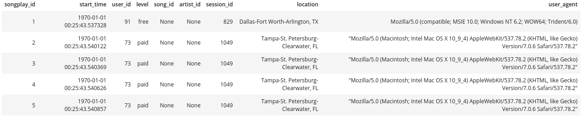
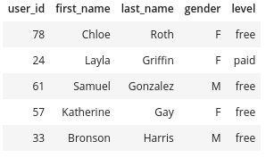
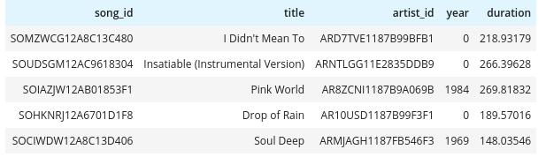
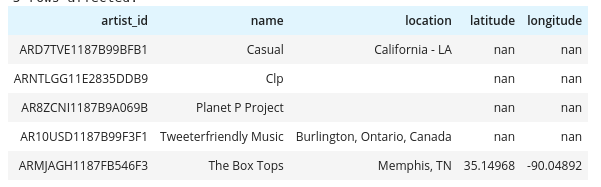
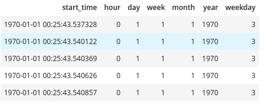

# Data Modeling with Postgres

## Required libraries

- pandas
- psycopg2
- sql_queries

## Motivation

Hands on experience of using postgres on real data. In this learning, the fact and dimension tables are created. The data is composed of JSON format.

## Project

Data model is based on star schema. There is one fact table while 3 others are the dimension tables. The data for this analysis is provided in the folder "data" where it has two main sub-folders 'log_data', and 'song_data'. This schema is optimized for queries on the song play analysis. 

## Files

- etl.ipynb: Here ETL process is developed, and user can view each table and output in detail
- test.ipynb: This notebook is for sanity checks to test sql_queries.py and elt.ipynb (etl.py) 
- create_tables.py: It first delets the existing table and then create the empty tables
- elt.py: This reads data from json files and insert into tables created by create_tables file. It has whole ETL process.
- sql_queries.py: It contains SQL queries of creating tables and inserting data into those tables

## Data

### Songs metadata

The files are partitioned by the first three letters of each song's track ID. For example, here are filepaths to two files in this dataset.

```
song_data/A/B/C/TRABCEI128F424C983.json
song_data/A/A/B/TRAABJL12903CDCF1A.json
```

And below is an example of what a single song file, TRAABJL12903CDCF1A.json, looks like.

```
{"num_songs": 1, "artist_id": "ARJIE2Y1187B994AB7", "artist_latitude": null, "artist_longitude": null, "artist_location": "", "artist_name": "Line Renaud", "song_id": "SOUPIRU12A6D4FA1E1", "title": "Der Kleine Dompfaff", "duration": 152.92036, "year": 0}
```

### User activity logs

The log files in the dataset you'll be working with are partitioned by year and month. For example, here are filepaths to two files in this dataset.

```
log_data/2018/11/2018-11-12-events.json
log_data/2018/11/2018-11-13-events.json
```

And below is an example of what a single activity log in 2018-11-13-events.json, looks like.

```
{"artist":null,"auth":"Logged In","firstName":"Kevin","gender":"M","itemInSession":0,"lastName":"Arellano","length":null,"level":"free","location":"Harrisburg-Carlisle, PA","method":"GET","page":"Home","registration":1540006905796.0,"sessionId":514,"song":null,"status":200,"ts":1542069417796,"userAgent":"\"Mozilla\/5.0 (Macintosh; Intel Mac OS X 10_9_4) AppleWebKit\/537.36 (KHTML, like Gecko) Chrome\/36.0.1985.125 Safari\/537.36\"","userId":"66"}
```

## ETL Processes

The summary of ETL processes is below.
For more details, see etl.ipynb, etl.py and sql_queries.py.

### Songs metadata

#### #1: songs table

- Parse and read a song JSON file by using pandas.read_json function.
- Select columns for song ID, title, artist ID, year, and duration from dataframe.
- Execute an insert query to songs table in PostgreSQL.
  - If the song ID confliction is occured, do nothing.
- Repeat the process iterably for all songs data.

#### #2: artists table

- Parse and read a song JSON file by using pandas.read_json function.
- Select columns for artist ID, name, location, latitude, and longitude from dataframe.
- Execute an insert query to artists table in PostgreSQL.
  - If the artist ID confliction is occured, do nothing.
- Repeat the process iterably for all songs data.

### User activity logs

#### #3: time table

- Parse and read a JSON file of user activity log by using pandas.read_json function.
- Filter records by NextSong action.
- Convert the ts timestamp column to datetime.
- Extract the timestamp, hour, day, week of year, month, year, and weekday from dataframe.
- Execute an insert query to time table in PostgreSQL.
- Repeat the process iterably for all log files.

#### #4: users table

- Parse and read a JSON file of user activity log by using pandas.read_json function.
- Filter records by NextSong action.
- Select columns for user ID, first name, last name, gender and level from dataframe.
- Execute an insert query to songs table in PostgreSQL.
  - If the user ID confliction is occured, Update value of level on the recored.
- Repeat the process iterably for all log files.

#### #4: songsplays table

- Parse and read a JSON file of user activity log by using pandas.read_json function.
- Filter records by NextSong action.
- Select the timestamp, user ID, level, song ID, artist ID, session ID, location, and user agent from dataframe.
  - Log files don't include song ID and artist ID, so get these ID by executing select query to songs and artists tables.
- Execute an insert query to songs table in PostgreSQL.
- Repeat the process iterably for all log files.

## Usage

Create tables and execute ETL.

```
$ python create_tables.py 
$ python etl.py
```

## Result tables

### Fact Table

#### songplays - records in log data associated with song plays.
- table description
Data columns (total 8 columns):
|Column|     Non-Null Count|  Dtype|         
|------|     --------------|  -----|         
|ts|         330 non-null|    datetime64[ns]|
|userId|     330 non-null|    object|        
|level|      330 non-null|    object|        
|songid|     0 non-null|      object|        
|artistid|   0 non-null|      object|        
|sessionId|  330 non-null|    int64|         
|location|   330 non-null|    object|        
|userAgent|  330 non-null|    object|        
dtypes: datetime64[ns](1), int64(1), object(6)
memory usage: 20.8+ KB


- examples


### Dimension Tables

#### users - users in the app
- table description
Data columns (total 5 columns):
|Column|     Non-Null Count|  Dtype| 
|------|     --------------|  ----- |
|userId|     330 non-null  |  object|
|firstName|  330 non-null  |  object|
|lastName |  330 non-null  |  object|
|gender   |  330 non-null  |  object|
|level    |  330 non-null  |  object|
dtypes: object(5)
memory usage: 15.5+ KB
- examples


#### songs - songs in music database
- table description
Data columns (total 5 columns):
|Column|     Non-Null Count|  Dtype|  
|------ |    --------------|  ----- | 
|song_id |   1 non-null    |  object |
|title    |  1 non-null    |  object |
|artist_id|  1 non-null    |  object |
|year     |  1 non-null    |  int64  |
|duration |  1 non-null    |  float64|
dtypes: float64(1), int64(1), object(3)
memory usage: 168.0+ bytes

- examples


#### artists - artists in music database
- table description
Data columns (total 5 columns):
|Column|            Non-Null Count|  Dtype|  
|------ |           --------------|  ----- | 
|artist_id|         1 non-null    |  object |
|artist_name|       1 non-null    |  object |
|artist_location|   1 non-null    |  object |
|artist_latitude |  0 non-null    |  float64|
|artist_longitude|  0 non-null    |  float64|
dtypes: float64(2), object(3)
memory usage: 168.0+ bytes


- examples


#### time - timestamps of records in songplays broken down into specific units
- table description
Data columns (total 7 columns):
|Column|   Non-Null Count|  Dtype|         
|------ |  --------------|  ----- |        
|time   |  330 non-null  |  datetime64[ns]|
|hour   |  330 non-null  |  int64         |
|day    |  330 non-null  |  int64         |
|week   |  330 non-null  |  int64         |
|month  |  330 non-null  |  int64         |
|year   |  330 non-null  |  int64         |
|weekday|  330 non-null  |  int64         |
dtypes: datetime64[ns](1), int64(6)

- examples
 

## Acknowledgements

I wish to thank Udacity for wonderful lessons and learning material.
